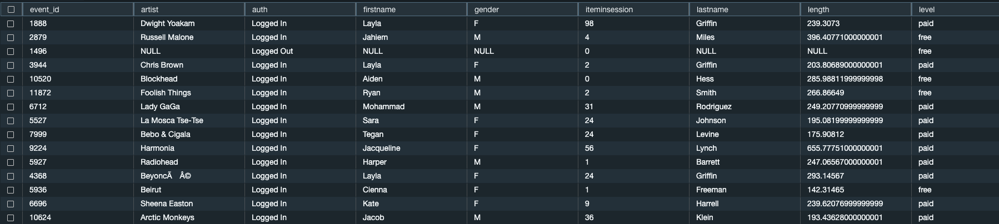
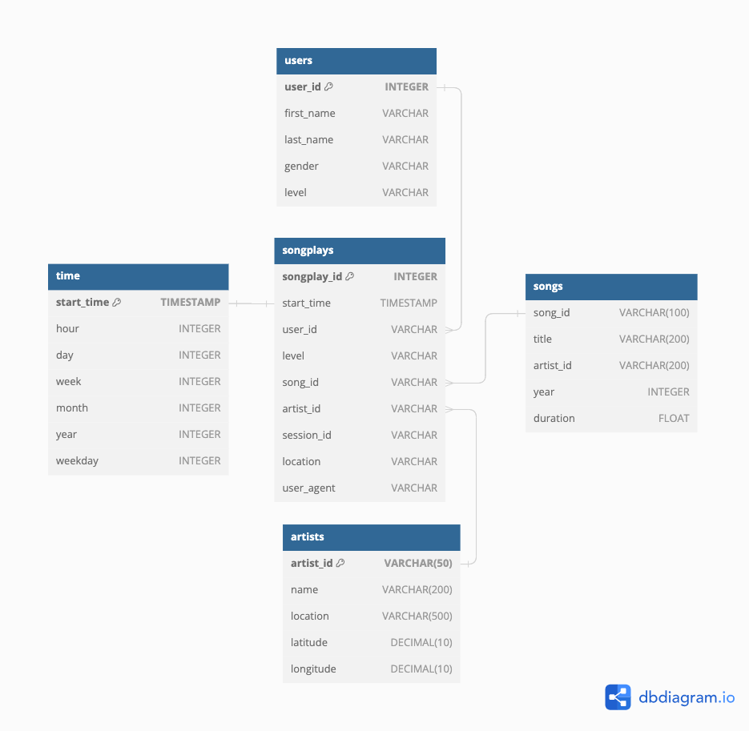

# 2 Data Warehouse Project - Sparkify

## Introduction
Sparkify, a music streaming startup, seeks to migrate their data and processes to the cloud. Their data, stored in Amazon S3, consists of JSON logs on user activity and song metadata. As the data engineer, our task is to build an ETL pipeline, extracting data from S3, staging it in Amazon Redshift, and transforming it into dimensional tables for analytics.

## Project Overview
This project involves:
- Extracting data from Amazon S3.
- Staging data in Amazon Redshift.
- Transforming staged data into dimensional tables.
- Optional: Running some analytics queries

## System Architecture
The DWH we build for Sparkify is contructed in star schema to allow for simple analytical tasks. Since the DWH is rather small, we chose a star schema for its simplicity and ease of use. Star schemas are optimized for query performance and therfore allow for quick analytics. Another point is the fact that Sparkify is quickly growing. Therefore we need a DWH that is scalable and flexible. 

### Raw Data
The source data is store in two tables in publicly available Amazon S3 Buckets. The files are:  

**Song data:** 
s3://udacity-dend/song_data  
The song data is a subset of real data from the [million song dataset](https://[duckduckgo.com](http://millionsongdataset.com/)). It contains metadata about songs and the artist of that song 

**Log data:** 
s3://udacity-dend/log_data  
The event data in the logs is generated by [this event simulator](https://github.com/Interana/eventsim). The data are artificially simulated event logs for a imaginary streaming service. 

**Log data json path:**
s3://udacity-dend/log_json_path.json  
Contains meta data that is required by AWS to correctly load the tables. 

### The DWH consists of five tables: 
1. **Songplays (Fact table):**
Columns: start_time (PK), userd_id, level, song_id, artist_id, session_id, location, user_agent
2. **Users (Dimension table):**
Columns: user_id (PK), first_name, last_name, gender, level (e.g. does the user own a paid plan)
3. **Songs (Dimension table)**
Columns: song_id (PK), title, artist_id, year, duration
4. **Artists (Dimension table)**
Columns: artist_id (PK), name, location, latitude, longitude
5. **Time (Dimension table)**
Columsn: start_time (PK, needs to be converted to DateTime format), hour, day, week, month , year, weekday

**Graphical representation of the DWH schema**

*(the code to generate this schema is included with the additional material)* 

## How to run the pipeline: 
1. **Prepare your AWS services**  
You need to set up your AWS services on your side before you can use the scripts in this repository. Create an IAM user and role that has read access to S3 (I gave it admin right to be sure) and assign it to the Redshift cluster you are using. I used Redshift serverless since the performance was better the cheap dedicated cluster I was using. 
2. **Update the information in the dwh.cfg** 
Use the information from the services you just created in AWS to fill the empty fields in dwh.cfg (Redshift cluster, IAM Role, S3 Paths from raw data)
3. **Install packages required for the scripts** 
Currently needed: configparser, psycopg2, logging. Since AWS objects are manually set up no BOTO3 required at the moment. 
4. **Run create_tables.py**
This swill delete possibly existing tables and create them, so all the necessary tables are predefined as empty tables.
5. **Run etl.py** 
This will execute the data pipeline. First, data is copied from the publich S3 Buckets to the staging tables on redshift. Then the data from the staging table is distributed into the five star schema tables. This inclused four dimension tables (*users, time, songs, artists*) and the fact table (*songplays*)
6. **Optional: Run analytical queries** 
The folder additional_material contains the file analytics.sql where I prepared a couple analystics SQL queries to get an overview of basic metrics. 

## Quality check: 
I set up a logging file that counts Null Values in the DWH Tables. Check out *additional_material/etl.log* for the results after running the pipeline. The number of inserted rows is displayed in the console when running the script. The tables do not contain duplicates, since tables were filled using DISTINCT where necessary.